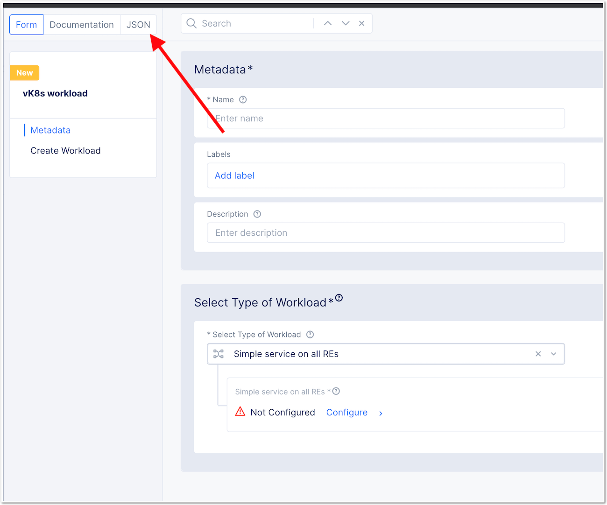

F5 LogConverter
####################################################

.. figure:: _picture/architecture.png

.. contents:: Table of Contents

Introduction
####################################################
Use Case
==================================================
LogConverter forwards http security event logs - received from `F5 XC <https://docs.cloud.f5.com/docs/api/app-security>`_ - to remote servers (log collector, SIEM).

Supported downstream protocol:

- Syslog
- HTTP(s) + Bearer token

Demo (private)
==================================================
Video `here <https://web.microsoftstream.com/video/fc54731f-b9ac-4e27-b1f3-465beca286cf>`_ is private, please ask your SE for authorizing access.

Security consideration
==================================================
No logs are stored. LogConverter receives logs and then PUSH them directly to remote log collector servers.

Deployment Guide
####################################################
Regional Edge | Container hosted in a F5 XC POP
==================================================

Create the workload
*******************

- Create a vK8S in your namespace
- In Workloads, create a new vK8S `workload`
- Do not configure any setting, but click on `JSON` on the top 

- Overwrite the JSON blob by the one `here <https://github.com/nergalex/f5-log-converter/blob/master/workload.json>` and DOP NOT APPLY YET
- Before applying, change the `namespace` value on line 4. Put the NameSpace where the app is running.
- Click `Save and Exit`

Modify the workload config to push logs to the right destination
****************************************************************

- Edit the created workload `logstream-xc2`

- Edit the `File` object

Customer Edge | Container hosted in a VM/docker
==================================================

Bootstrap
**************************************************
- Deploy a Linux VM. Example in Azure:
    - publisher: Canonical
    - offer: 0001-com-ubuntu-server-impish
    - sku: 21_10-gen2
    - version: latest

Install docker
**************************************************
- Connect on your VM
- Install docker by following `this guide <https://docs.docker.com/get-docker/>`_. Example:
    - `Ubuntu <https://docs.docker.com/engine/install/ubuntu/>`_

.. code:: bash

    sudo apt-get update
    sudo apt-get install \
    ca-certificates \
    curl \
    gnupg \
    lsb-release
    curl -fsSL https://download.docker.com/linux/ubuntu/gpg | sudo gpg --dearmor -o /usr/share/keyrings/docker-archive-keyring.gpg
    echo \
      "deb [arch=$(dpkg --print-architecture) signed-by=/usr/share/keyrings/docker-archive-keyring.gpg] https://download.docker.com/linux/ubuntu \
      $(lsb_release -cs) stable" | sudo tee /etc/apt/sources.list.d/docker.list > /dev/null
    sudo apt-get update
    sudo apt-get install docker-ce docker-ce-cli containerd.io

- Determine your username

.. code:: bash

    whoami

- Set a variable with your username by replacing ``myUserName`` bellow

.. code:: bash

    export USER=myUserName

- Add your user to the docker group

.. code:: bash

    sudo usermod -aG docker ${USER}

- Log out and log back in so that your group membership is re-evaluated
- Verify that your user is a member of group ``docker`` in the returned list

.. code:: bash

    id

- Verify that you can run docker commands without sudo

.. code:: bash

    docker run hello-world

If you encounter an issue, follow this `article <https://www.digitalocean.com/community/questions/how-to-fix-docker-got-permission-denied-while-trying-to-connect-to-the-docker-daemon-socket>`_

Prepare configuration
**************************************************
- Create a Declaration file based on specification defined in ``Administration guide``

Deploy image
**************************************************
- Download image

.. code:: json

    docker pull registry.gitlab.com/nergalex/f5-xc-logstream/logstream-xc:ce

- Create and run a container. Replace values in the command line:
    - ``${{ env.LOCAL_DECLARATION }}``: absolute path to your declaration file

.. code:: json

    docker run -dit -h logstream-xc --restart=always --name=logstream-xc -p 8000:8000 -p 80:8080 -p 443:8443 -v ${{ env.LOCAL_DECLARATION }}:/etc/faas-apps/logstream-xc/declaration.json logstream-xc:ce

Administration guide
##################################################
Specification of LogConverter are stored as a declaration in JSON format.

API reference
==================================================
- OpenAPI specification `here <https://github.com/nergalex/f5-log-converter/blob/master/swagger.json>`_
- Log on `swaggerhub <https://app.swaggerhub.com/>`_
- Click ``on Create new`` > ``Import and document API``
    - URL: https://raw.githubusercontent.com/nergalex/f5-log-converter/master/swagger.json
- Browse API endpoint ``POST /declare``
- Click on Model
- See expected key/value to define in a Declaration

Example
==================================================
Simple
**************************************************
A declaration of one syslog server

.. code:: json

    {
        "f5xc_tenant": {
            "api_key": "XXXXXXXXXXXXX",
            "name": "f5-emea-ent",
            "namespaces": [
                {
                    "event_filter": {
                        "sec_event_type": "waf_sec_event"
                    },
                    "name": "aNameSpace"
                }
            ]
        },
        "logcollector": {
            "syslog": [
                {
                    "ip_address": "127.100.0.8",
                    "port": 5140
                }
            ]
        }
    }

Advanced
**************************************************
A declaration of one syslog server:

    - one Syslog server
    - one HTTP server
    - A starting date to retrieve logs. Date must be less than 24h before now

.. code:: json

    {
        "f5xc_tenant": {
            "api_key": "XXXXXXXXXXXXX",
            "name": "f5-emea-ent",
            "namespaces": [
                {
                    "event_filter": {
                        "sec_event_type": "waf_sec_event"
                    },
                    "name": "aNameSpace",
                    "event_start_time": {
                        "year": 2022,
                        "month": 4,
                        "day": 10,
                        "hour": 20,
                        "minute": 0
                    }
                }
            ]
        },
        "logcollector": {
            "http": [
                {
                    "host": "52.177.94.15",
                    "port": 8888,
                    "path": "/debug.test"
                }
            ],
            "syslog": [
                {
                    "ip_address": "52.177.94.15",
                    "port": 5140
                }
            ]
        }
    }

Log format
==================================================

INPUT - F5 XC - JSON
***************************

.. code:: json

    {
      "app_type": "cloudbuilder",
      "signatures": [
        {
          "attack_type": "ATTACK_TYPE_CROSS_SITE_SCRIPTING",
          "matching_info": "Matched 7 characters on offset 7 against value: '/c/?a='. ",
          "context": "header (path)",
          "name": "XSS script tag end (Headers)",
          "accuracy": "high_accuracy",
          "id": "200000091",
          "state": "Enabled",
          "id_name": "200000091, XSS script tag end (Headers)"
        },
        {
          "attack_type": "ATTACK_TYPE_CROSS_SITE_SCRIPTING",
          "matching_info": "Matched 7 characters on offset 6 against value: '/c/?a='. ",
          "context": "header (path)",
          "name": "XSS script tag (Headers)",
          "accuracy": "high_accuracy",
          "id": "200000097",
          "state": "Enabled",
          "id_name": "200000097, XSS script tag (Headers)"
        },
        {
          "attack_type": "ATTACK_TYPE_CROSS_SITE_SCRIPTING",
          "matching_info": "Matched 7 characters on offset 2 against value: 'a='. ",
          "context": "parameter (a)",
          "name": "XSS script tag (Parameter)",
          "accuracy": "high_accuracy",
          "id": "200000098",
          "state": "Enabled",
          "id_name": "200000098, XSS script tag (Parameter)"
        },
        {
          "attack_type": "ATTACK_TYPE_CROSS_SITE_SCRIPTING",
          "matching_info": "Matched 7 characters on offset 3 against value: 'a='. ",
          "context": "parameter (a)",
          "name": "XSS script tag end (Parameter) (2)",
          "accuracy": "high_accuracy",
          "id": "200001475",
          "state": "Enabled",
          "id_name": "200001475, XSS script tag end (Parameter) (2)"
        }
      ],
      "req_id": "7d2d785c-0f32-4f4d-8bf1-c2a1032227ed",
      "hostname": "master-13",
      "bot_verification_failed": false,
      "original_authority": "",
      "rtt_upstream_seconds": "",
      "src_instance": "FR",
      "req_headers": "{\"Accept\":\"text/html,application/xhtml+xml,application/xml;q=0.9,image/avif,image/webp,image/apng,*/*;q=0.8,application/signed-exchange;v=b3;q=0.9\",\"Accept-Encoding\":\"gzip, deflate, br\",\"Accept-Language\":\"en-US,en;q=0.9,fr;q=0.8\",\"Cache-Control\":\"max-age=0\",\"Cookie\":\"1d625=1649083663121-224247291; _imp_apg_r_=%7B%22diA%22%3A%22AciXP2IAAAAAgyqEB%2BOQg7HcJ9AtrCIU%22%2C%22diB%22%3A%22AdLY9pzeIosqLRJ7XWTN8I8rcD5GcoYO%22%7D; _imp_di_pc_=AciXP2IAAAAAgyqEB%2BOQg7HcJ9AtrCIU; 1d6203=4Q6H4PTMi9x7pRoC4tvaF7kZmANgGjGLk9xFninLl+IlFGsyvlnCNXxuJRHwT/Z4B67Fs3AOzSdTuYGjgdUEbBFSMgioG0ihuMqwdSa/mwcC0KNiwRBQgGvEPc0JFL2tglq2mOj+yRVnVZAIkJL4k7hiIU/BnUhKRdaqIN6i/QCJiWND; TS01120553=01795b7bc030829070ed3521d4fbcd0e6d8c9d951fb851bdefdc7efeb0a5695e916088d988f80e321180b744b96e5a5269e76667c5; TS01120553028=01d8db7103af00b2ca08ea64cf2be04fe54b5267b7ac39dbed20a7d2bf5ee1d29c2c300163ce3ba71d1519cf502c69e8fd8b727c88; TS01dc4fc6=01371e37ded1361e15dc34629806271234fdca4b53165b822945af4df88a06de5a431140d6e65a8ee28d1d553966c2ac4473e530dd; 1d621=3c457337a368d5a5bcc0991ac95a444900003d5a3029dab13d60\",\"Host\":\"sentence-front-managed1.f5dc.dev\",\"Method\":\"GET\",\"Path\":\"/c/?a=%3Cscript%3Ecat%20/etc/password%3C/script%3E\",\"Scheme\":\"https\",\"Sec-Ch-Ua\":\"\\\" Not A;Brand\\\";v=\\\"99\\\", \\\"Chromium\\\";v=\\\"100\\\", \\\"Google Chrome\\\";v=\\\"100\\\"\",\"Sec-Ch-Ua-Mobile\":\"?0\",\"Sec-Ch-Ua-Platform\":\"\\\"Windows\\\"\",\"Sec-Fetch-Dest\":\"document\",\"Sec-Fetch-Mode\":\"navigate\",\"Sec-Fetch-Site\":\"none\",\"Sec-Fetch-User\":\"?1\",\"Upgrade-Insecure-Requests\":\"1\",\"User-Agent\":\"Mozilla/5.0 (Windows NT 10.0; Win64; x64) AppleWebKit/537.36 (KHTML, like Gecko) Chrome/100.0.4896.60 Safari/537.36\",\"X-Envoy-External-Address\":\"82.66.123.186\",\"X-Forwarded-For\":\"82.66.123.186\",\"X-Forwarded-Proto\":\"https\",\"X-Request-Id\":\"7d2d785c-0f32-4f4d-8bf1-c2a1032227ed\"}",
      "tenant": "f5-emea-ent-bceuutam",
      "app": "obelix",
      "policy_hits": {
        "policy_hits": {}
      },
      "method": "GET",
      "threat_campaigns": {},
      "violations": {},
      "source_type": "kafka",
      "dst_instance": "",
      "x_forwarded_for": "82.66.123.186",
      "duration_with_no_data_tx_delay": "",
      "waf_rule_tags": "{}",
      "rsp_code_class": "2xx",
      "waf_mode": "block",
      "time_to_last_upstream_rx_byte": 0,
      "scheme": "",
      "city": "",
      "dst_site": "",
      "latitude": "48.858200",
      "messageid": "c102667e-dea5-4551-b495-71bf4217a9f6",
      "no_active_detections": false,
      "tls_version": "",
      "duration_with_data_tx_delay": "",
      "stream": "svcfw",
      "violation_rating": "5",
      "req_size": "1640",
      "waf_rules_hit": "[]",
      "tls_fingerprint": "6351a79c0fa176d8764f5712c1f02895",
      "time_to_first_upstream_rx_byte": 0,
      "sni": "sentence-front-managed1.f5dc.dev",
      "response_flags": "",
      "site": "pa4-par",
      "@timestamp": "2022-04-10T21:14:25.855Z",
      "calculated_action": "block",
      "req_params": "a=%3Cscript%3Ecat%20/etc/password%3C/script%3E",
      "sample_rate": "",
      "original_headers": [
        "method",
        "host",
        "scheme",
        "path",
        "cache-control",
        "sec-ch-ua",
        "sec-ch-ua-mobile",
        "sec-ch-ua-platform",
        "upgrade-insecure-requests",
        "user-agent",
        "accept",
        "sec-fetch-site",
        "sec-fetch-mode",
        "sec-fetch-user",
        "sec-fetch-dest",
        "accept-encoding",
        "accept-language",
        "cookie",
        "x-forwarded-for",
        "x-forwarded-proto",
        "x-envoy-external-address",
        "x-request-id"
      ],
      "dst_port": "0",
      "req_path": "/c/",
      "asn": "Free SAS(12322)",
      "node_id": "",
      "proxy_type": "",
      "is_truncated_field": false,
      "country": "FR",
      "kubernetes": {},
      "browser_type": "Chrome",
      "device_type": "Other",
      "bot_classification": "",
      "vhost_id": "017d647f-b87d-4eac-99e5-98c7cfa91d62",
      "detections": {},
      "longitude": "2.338700",
      "rtt_downstream_seconds": "",
      "http_version": "HTTP/1.1",
      "time_to_last_downstream_tx_byte": 0,
      "waf_rule_hit_count": "",
      "num_rules_hit": "",
      "vh_type": "",
      "rsp_size": "0",
      "api_endpoint": "{}",
      "authority": "sentence-front-managed1.f5dc.dev",
      "region": "",
      "time_to_first_downstream_tx_byte": 0,
      "rsp_code_details": "",
      "dst": "",
      "connection_state": "",
      "dst_ip": "72.19.3.187",
      "is_new_dcid": false,
      "network": "82.66.122.0",
      "src_site": "pa4-par",
      "src_ip": "82.66.123.186",
      "tls_cipher_suite": "",
      "original_path": "",
      "message_key": null,
      "user_agent": "Mozilla/5.0 (Windows NT 10.0; Win64; x64) AppleWebKit/537.36 (KHTML, like Gecko) Chrome/100.0.4896.60 Safari/537.36",
      "severity": "info",
      "cluster_name": "pa4-par-int-ves-io",
      "headers": {},
      "types": "input:string",
      "src": "N:public",
      "rsp_code": "200",
      "time_to_first_upstream_tx_byte": 0,
      "attack_types": [
        {
          "name": "ATTACK_TYPE_CROSS_SITE_SCRIPTING"
        }
      ],
      "src_port": "58950",
      "dcid": "1649083663121-224247291",
      "req_body": "",
      "time_to_last_upstream_tx_byte": 0,
      "namespace": "al-dacosta",
      "time": "2022-04-10T21:14:25.855Z",
      "waf_instance_id": "",
      "sec_event_type": "waf_sec_event",
      "user": "Cookie-_imp_di_pc_-AciXP2IAAAAAgyqEB%2BOQg7HcJ9AtrCIU",
      "vh_name": "ves-io-http-loadbalancer-sentence-front-managed1"
    }

OUTPUT - HTTP(S) - JSON
***************************

.. code:: json

    {
        "app": "sentence-front-managed1.f5dc.dev",
        "bot_classification": "",
        "bot_verification_failed": false,
        "browser_type": "Chrome",
        "attack_types":
        [
            {
                "name": "ATTACK_TYPE_CROSS_SITE_SCRIPTING"
            }
        ],
        "component": "/c/",
        "correlation_id": "c102667e-dea5-4551-b495-71bf4217a9f6",
        "description": "ves-io-http-loadbalancer-sentence-front-managed1",
        "environment": "f5-emea-ent-bceuutam",
        "gateway": "pa4-par",
        "http.hostname": "sentence-front-managed1.f5dc.dev",
        "http.remote_addr": "82.66.123.186",
        "http.remote_port": "58950",
        "http.request_method": "GET",
        "http.response_code": "200",
        "http.server_addr": "72.19.3.187",
        "http.server_port": "0",
        "http.uri": "/c/?a=%3Cscript%3Ecat%20/etc/password%3C/script%3E",
        "is_truncated": false,
        "level": "info",
        "policy_name": "NotAvailable",
        "request_headers":
        {
            "Accept": "text/html,application/xhtml+xml,application/xml;q=0.9,image/avif,image/webp,image/apng,*/*;q=0.8,application/signed-exchange;v=b3;q=0.9",
            "Accept-Encoding": "gzip, deflate, br",
            "Accept-Language": "en-US,en;q=0.9,fr;q=0.8",
            "Cache-Control": "max-age=0",
            "Cookie": "1d625=1649083663121-224247291; _imp_apg_r_=%7B%22diA%22%3A%22AciXP2IAAAAAgyqEB%2BOQg7HcJ9AtrCIU%22%2C%22diB%22%3A%22AdLY9pzeIosqLRJ7XWTN8I8rcD5GcoYO%22%7D; _imp_di_pc_=AciXP2IAAAAAgyqEB%2BOQg7HcJ9AtrCIU; 1d6203=4Q6H4PTMi9x7pRoC4tvaF7kZmANgGjGLk9xFninLl+IlFGsyvlnCNXxuJRHwT/Z4B67Fs3AOzSdTuYGjgdUEbBFSMgioG0ihuMqwdSa/mwcC0KNiwRBQgGvEPc0JFL2tglq2mOj+yRVnVZAIkJL4k7hiIU/BnUhKRdaqIN6i/QCJiWND; TS01120553=01795b7bc030829070ed3521d4fbcd0e6d8c9d951fb851bdefdc7efeb0a5695e916088d988f80e321180b744b96e5a5269e76667c5; TS01120553028=01d8db7103af00b2ca08ea64cf2be04fe54b5267b7ac39dbed20a7d2bf5ee1d29c2c300163ce3ba71d1519cf502c69e8fd8b727c88; TS01dc4fc6=01371e37ded1361e15dc34629806271234fdca4b53165b822945af4df88a06de5a431140d6e65a8ee28d1d553966c2ac4473e530dd; 1d621=3c457337a368d5a5bcc0991ac95a444900003d5a3029dab13d60",
            "Host": "sentence-front-managed1.f5dc.dev",
            "Method": "GET",
            "Path": "/c/?a=%3Cscript%3Ecat%20/etc/password%3C/script%3E",
            "Scheme": "https",
            "Sec-Ch-Ua": "\" Not A;Brand\";v=\"99\", \"Chromium\";v=\"100\", \"Google Chrome\";v=\"100\"",
            "Sec-Ch-Ua-Mobile": "?0",
            "Sec-Ch-Ua-Platform": "\"Windows\"",
            "Sec-Fetch-Dest": "document",
            "Sec-Fetch-Mode": "navigate",
            "Sec-Fetch-Site": "none",
            "Sec-Fetch-User": "?1",
            "Upgrade-Insecure-Requests": "1",
            "User-Agent": "Mozilla/5.0 (Windows NT 10.0; Win64; x64) AppleWebKit/537.36 (KHTML, like Gecko) Chrome/100.0.4896.60 Safari/537.36",
            "X-Envoy-External-Address": "82.66.123.186",
            "X-Forwarded-For": "82.66.123.186",
            "X-Forwarded-Proto": "https",
            "X-Request-Id": "7d2d785c-0f32-4f4d-8bf1-c2a1032227ed"
        },
        "request_outcome": "block",
        "request_outcome_reason": "NotAvailable",
        "signatures":
        [
            {
                "attack_type": "ATTACK_TYPE_CROSS_SITE_SCRIPTING",
                "matching_info": "Matched 7 characters on offset 7 against value: '/c/?a='. ",
                "context": "header (path)",
                "name": "XSS script tag end (Headers)",
                "accuracy": "high_accuracy",
                "id": "200000091",
                "state": "Enabled",
                "id_name": "200000091, XSS script tag end (Headers)"
            },
            {
                "attack_type": "ATTACK_TYPE_CROSS_SITE_SCRIPTING",
                "matching_info": "Matched 7 characters on offset 6 against value: '/c/?a='. ",
                "context": "header (path)",
                "name": "XSS script tag (Headers)",
                "accuracy": "high_accuracy",
                "id": "200000097",
                "state": "Enabled",
                "id_name": "200000097, XSS script tag (Headers)"
            },
            {
                "attack_type": "ATTACK_TYPE_CROSS_SITE_SCRIPTING",
                "matching_info": "Matched 7 characters on offset 2 against value: 'a='. ",
                "context": "parameter (a)",
                "name": "XSS script tag (Parameter)",
                "accuracy": "high_accuracy",
                "id": "200000098",
                "state": "Enabled",
                "id_name": "200000098, XSS script tag (Parameter)"
            },
            {
                "attack_type": "ATTACK_TYPE_CROSS_SITE_SCRIPTING",
                "matching_info": "Matched 7 characters on offset 3 against value: 'a='. ",
                "context": "parameter (a)",
                "name": "XSS script tag end (Parameter) (2)",
                "accuracy": "high_accuracy",
                "id": "200001475",
                "state": "Enabled",
                "id_name": "200001475, XSS script tag end (Parameter) (2)"
            }
        ],
        "signature_ids":
        [
            "200000091",
            "200000097",
            "200000098",
            "200001475"
        ],
        "signature_names":
        [
            "200000091, XSS script tag end (Headers)",
            "200000097, XSS script tag (Headers)",
            "200000098, XSS script tag (Parameter)",
            "200001475, XSS script tag end (Parameter) (2)"
        ],
        "sub_violations": "NotAvailable",
        "support_id": "7d2d785c-0f32-4f4d-8bf1-c2a1032227ed",
        "type": "waf_sec_event",
        "version": "HTTP/1.1",
        "violation_rating": "5",
        "violations": {},
        "x_forwarded_for_header_value": "82.66.123.186",
        "event_host": "master-13",
        "event_source": "pa4-par",
        "event_sourcetype": "kafka",
        "event_time": "2022-04-10T21:14:25.855Z"
    }

OUTPUT - Syslog
***************************

:kbd:`2022-04-10 23:17:10.000000000 +0000 debug.LogConverter.user.warn: {"host":"LogConverter","ident":"logger","message":"app=sentence-front-managed1.f5dc.dev;bot_classification=;bot_verification_failed=False;browser_type=Chrome;attack_types=[{'name': 'ATTACK_TYPE_CROSS_SITE_SCRIPTING'}];component=/c/;correlation_id=c102667e-dea5-4551-b495-71bf4217a9f6;description=ves-io-http-loadbalancer-sentence-front-managed1;environment=f5-emea-ent-bceuutam;gateway=pa4-par;http.hostname=sentence-front-managed1.f5dc.dev;http.remote_addr=82.66.123.186;http.remote_port=58950;http.request_method=GET;http.response_code=200;http.server_addr=72.19.3.187;http.server_port=0;http.uri=/c/?a=%3Cscript%3Ecat%20/etc/password%3C/script%3E;is_truncated=False;level=info;policy_name=NotAvailable;request=NotAvailable;request_outcome=block;request_outcome_reason=NotAvailable;signature_cves=NotAvailable;signature_ids=['200000091', '200000097', '200000098', '200001475'];signature_names=['200000091, XSS script tag end (Headers)', '200000097, XSS script tag (Headers)', '200000098, XSS script tag (Parameter)', '200001475, XSS script tag end (Parameter) (2)'];sub_violations=NotAvailable;support_id=7d2d785c-0f32-4f4d-8bf1-c2a1032227ed;type=waf_sec_event;version=HTTP/1.1;violation_rating=NotAvailable;violations={};x_forwarded_for_header_value=82.66.123.186;event_host=master-13;event_source=pa4-par;event_sourcetype=kafka;event_time=2022-04-10T21:14:25.855Z"}`

Troubleshooting Guide
####################################################

Docker
==================================================

View container running in docker:

:kbd:`docker ps`

View containers:

:kbd:`docker ps -all`

Restart a container:

:kbd:`docker restart <container_id>`

Open a shell in a container:

:kbd:`docker exec -it <container_id> bash`

Customer Edge | Container hosted in a VM/docker
==================================================

View audit log:

:kbd:`tail -100 /var/log/unit/unit.log`

View access log:

:kbd:`tail -f /var/log/unit/access.log`

View app log:

:kbd:`tail -f /etc/faas-apps/logstream-xc/LogConverter.log`

View TLS configuration on Unit:

:kbd:`curl http://localhost:8000/certificates/logstream-xc/chain/0`

View App configuration on Unit:

:kbd:`curl http://localhost:8000/config/`

Regional Edge | Container hosted in a F5 XC POP
==================================================

View startup log:

:kbd:`cat /unit/docker-entrypoint.log`

View audit log:

:kbd:`tail -f /unit/unit.log`

View access log:

:kbd:`tail -f /unit/access.log`

View app log:

:kbd:`tail -f /unit/LogConverter.log`

View local configuration:

:kbd:`cat /config/declaration.json`

Server | Remote Log Collector
==================================================
This guide describes how to deploy a Log Collector using Fluentd

-  `Optimize the Network Kernel Parameters <https://docs.fluentd.org/installation/before-install#optimize-the-network-kernel-parameters>`_

.. code:: bash

    vi /etc/sysctl.conf
        net.core.somaxconn = 1024
        net.core.netdev_max_backlog = 5000
        net.core.rmem_max = 16777216
        net.core.wmem_max = 16777216
        net.ipv4.tcp_wmem = 4096 12582912 16777216
        net.ipv4.tcp_rmem = 4096 12582912 16777216
        net.ipv4.tcp_max_syn_backlog = 8096
        net.ipv4.tcp_slow_start_after_idle = 0
        net.ipv4.tcp_tw_reuse = 1
        net.ipv4.ip_local_port_range = 10240 65535
    sysctl -p

- Install `Fluentd <https://docs.fluentd.org/installation/install-by-rpm>`_

.. code:: bash

    curl -L https://toolbelt.treasuredata.com/sh/install-redhat-td-agent4.sh | sh

- Configure Fluentd with a TCP syslog INPUT

.. code:: bash

    vi /etc/td-agent/td-agent.conf

.. code:: xml

        <match debug.**>
          @type stdout
          @id output_stdout
        </match>
        <source>
          @type http
          @id input_http
          port 8888
          bind 0.0.0.0
        </source>
        <source>
          @type syslog
          tag debug.LogConverter
          port 5140
          bind 0.0.0.0
          <transport tcp>
            </transport>
        </source>

- Start service

.. code:: bash

    systemctl start td-agent.service

- Verify configuration

.. code:: bash

    tail -f -n 1 /var/log/td-agent/td-agent.log &
    curl -X POST -d 'json={"json":"message"}' http://localhost:8888/debug.test

References
####################################################
- Source code: `here <https://github.com/nergalex/f5-xc-logstream>`_

